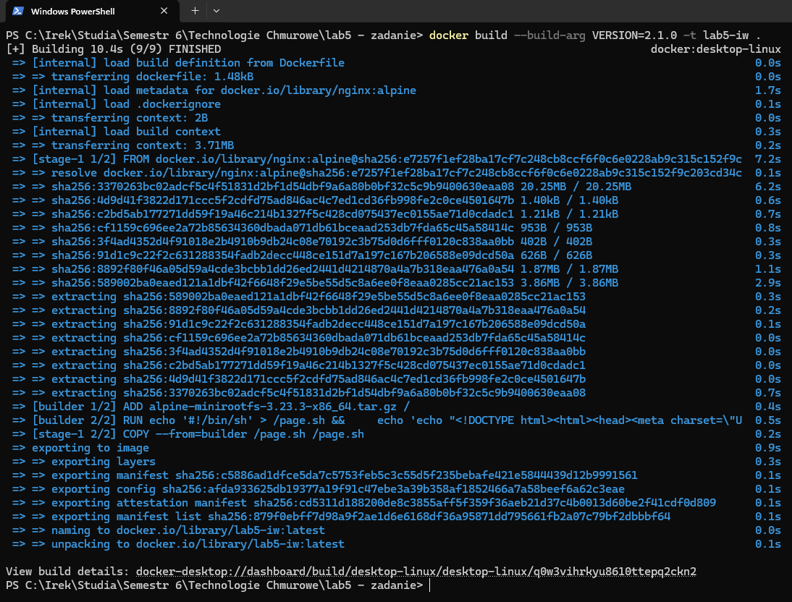
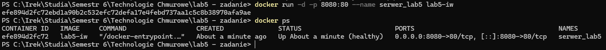
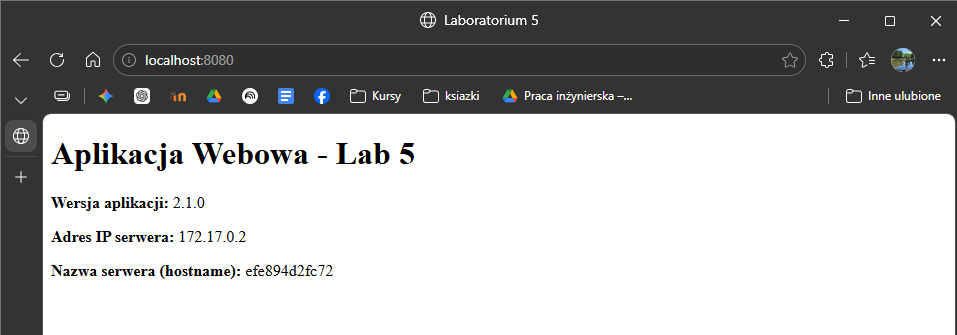

# Technologie Chmurowe - Laboratorium 5

**Imię i nazwisko:** Ireneusz Witek

**Grupa:** TI6.2

## Opis
Projekt stanowi realizację zadania z Laboratorium 5, którego celem jest demonstracja wieloetapowego budowania obrazów Docker.
Zgodnie z wymogami zadania, plik `Dockerfile` został podzielony na dwa etapy:
1. [cite_start]**Etap 1 (Builder):** Zbudowany od podstaw w oparciu o pusty obraz `scratch`[cite: 540]. Do środka wgrano minimalny system plików Alpine Linux za pomocą archiwum `.tar`. [cite_start]W tym etapie generowany jest skrypt startowy serwera, do którego wstrzykiwana jest wersja aplikacji (przez zmienną `ARG` [cite: 546][cite_start]) oraz skrypty odczytujące w locie `hostname` i adres IP kontenera[cite: 542, 543].
2. [cite_start]**Etap 2 (Produkcja):** Oparty na oficjalnym obrazie `nginx:alpine`[cite: 551]. [cite_start]Kopiuje on gotowy skrypt z pierwszego etapu[cite: 552]. [cite_start]Zaimplementowano w nim również instrukcję `HEALTHCHECK` opartą na poleceniu `curl`, która stale monitoruje dostępność aplikacji[cite: 554].
## Polecenia
**Budowa obrazu:**
```bash
docker build --pull --no-cache --build-arg VERSION=2.1.0 -t lab5-iw .
```


**Uruchomienie serwera oraz sprawdzenie działania:**
```bash
docker run -d -p 8080:80 --name serwer_lab5 lab5-iw
```
```bash
docker ps
```



